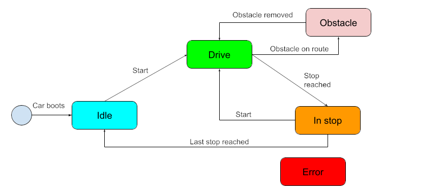
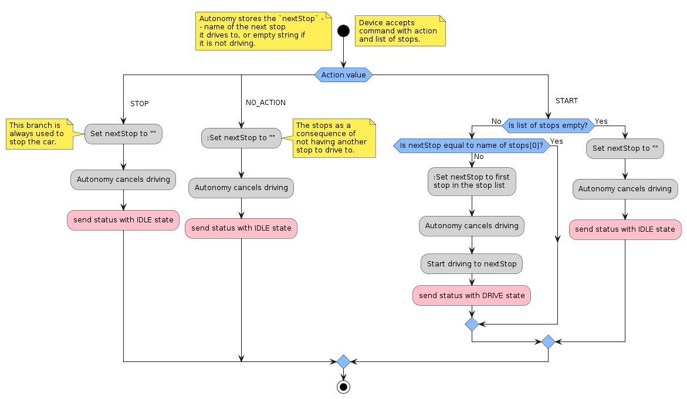

# Messages

## Structure

The basic message structure for message in Internal and External protocol is described [here](https://ref.bringautofleet.com/r/protocol/v2/2.0.1/message-structure).

Below, the data passed in the messages used in the External Protocol are described. The data structure can be also found in the [.proto](../lib/protobuf-mission-module/) file.

## Status payload data

Always contains
- state (State enum value: `IDLE`, `DRIVE`, `IN_STOP`, `OBSTACLE`, `ERROR`)

If state is `DRIVE` or `IN_STOP`, it must contain
- next stop (`Station`)

Optionally, the status contains
- telemetry (`Telemetry`)

Example:
```json
{
    "state": "DRIVE",
    "telemetry": {
        "position": {"latitude": 45.8137528, "longitude": 15.9870608, "altitude": 120.7},
        "speed": 7.2,
        "fuel": 0.62
    },
    "nextStop": {
        "name": "Ribnjak",
        "position": {"latitude": 45.815011, "longitude": 15.981919, "altitude": 125.3}
    }
}
```

## Status Error payload data

Always contains
- finished stops (list of Station)

Example:
```json
{
    "finishedStops": [
        {"name": "Trg Eugena Kvaternika", "position": {"latitude": 45.8144669, "longitude": 15.9965289, "altitude": 115.1}},
        {"name": "Vlaška", "position": {"latitude": 45.8139306, "longitude": 15.9913147, "altitude": 118.4}}
    ]
}
```

## Command payload data

Always contains
- action (Action enum value)
- stop (Station)
- stations (list of Station)
- route (string)

Example of command payload when car received the mission:
```json
{
    "action": "START",
    "stations": [
        {"name": "Ribnjak", "position": {"latitude": 45.815011, "longitude": 15.981919, "altitude": 125.3}},
        {"name": "Trg hrvatskih velikana", "position": {"latitude": 45.8120758, "longitude": 15.9837108, "altitude": 120.7}},
        {"name": "Trg Eugena Kvaternika", "position": {"latitude": 45.8144669, "longitude": 15.9965289, "altitude": 115.1}}
    ],
    "route": "Kvatrić"
}
```

Example of command payload when there is no mission defined for the car:
```json
{
    "action": "NO_ACTION",
    "stations": [],
    "route": ""
}
```

## Validation

The validation of each of the messages is done against the message structure described above (and in the [.proto](../lib/protobuf-mission-module/) file). The functions for validation:
- `parseAutonomyStatus` for status,
- `parseAutonomyError` for status error,
- `parseAutonomyCommand` for command.


# Device State

After connection, the autonomy device is in state `Idle`. The internal state of the Autonomy is driven by
- the received command (e.g., command stops names and the action value),
- the sensors for car orientation (e.g., some obstacle prevents car from driving).



The Autonomy keeps in memory the NAME of the next stop it should drive to (it can be empty). This stop is used when calling for change in the internal components of the Autonomy device driving the car. The actions taken by the autonomy after receiving command are shown below. Note the `route` in the command is informative and does not affect the actions.



The Autonomy device sends the status of the car to the Mission Module. The status contains field `State` with value correspoding to the state of the device (`DRIVE`, `IN_STOP`, `IDLE`, `OBSTACLE`, `ERROR`).